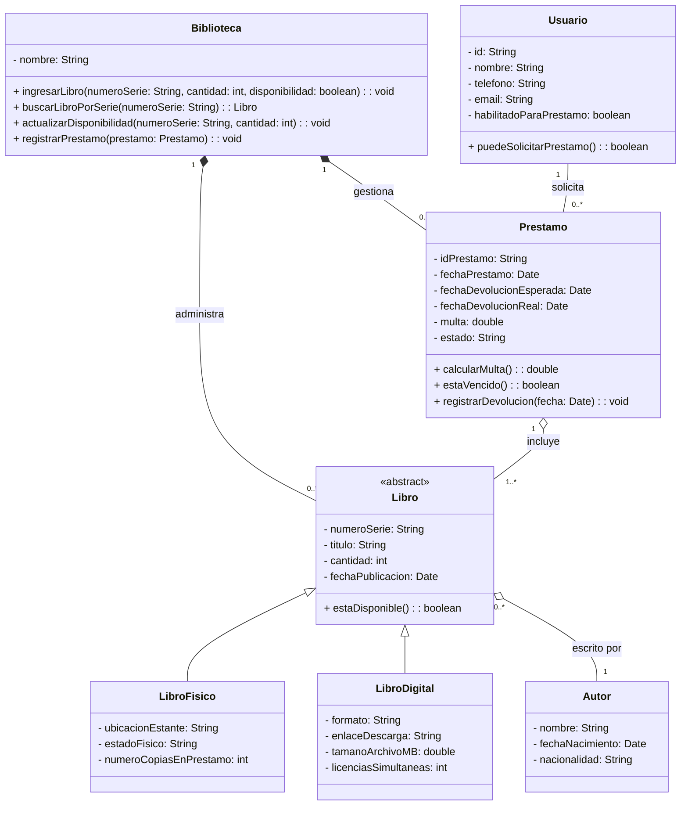

## Presentación de la Actividad

Un diagrama de clases UML es una representación gráfica que permite a los usuarios visualizar la estructura estática de un sistema de software mediante las clases que lo componen, sus atributos, métodos, relaciones entre ellas (asociación, herencia, agregación, composición, etc.). 
Su valor en el diseño de software orientado a objetos es que es una de las herramientas más básicas para la planificación y comunicación; apoya el proceso de desarrollo del diseño antes del código en los equipos de desarrollo de código, el conocimiento del sistema por parte de los miembros del equipo y la documentación técnica del proyecto durante las etapas de desarrollo. En este documento, se nos presenta este tipo de diagrama para representar las principales áreas del dominio (libros, autores, préstamos, etc.) y las relaciones entre ellas, como la autoría de una obra, el préstamo de un ejemplar a un usuario, etc. 
El desarrollo de este modelo se realizó con colaboración (utilizamos la plataforma de diagramación para construir un modelo juntos y visualizarlo PLANT) y un repositorio de GitHub para el control de versiones, la gestión del equipo, la organización de las contribuciones del equipo y la organización del progreso del proyecto.


##  Tabla de contenido

- [Objetivo general](#objetivo-principal)
- [Objetivos específicos](#objetivos-específicos)
- [Diagrama de clases](#-diagrama-de-clases)
- [Descripción de las clases](#-descripción-de-las-clases-identificadas)
- [Justificación de las relaciones](#-justificación-de-las-relaciones-utilizadas)
- [Cohesión, bajo acoplamiento y SOLID](#-aplicación-de-cohesión-bajo-acoplamiento-y-solid)
- [Código Fuente UML](#código-fuente-uml)
- [Archivos del proyecto](#-archivos-del-proyecto)

## Objetivo Principal

Diseñar e implementar un sistema de gestión de bibliotecas que incorpore la teoría de la Programación Orientada a Objetos (abstracción, encapsulamiento, herencia y polimorfismo) y los principios SOLID para crear un modelo de clases robusto, mantenible y escalable. 

## Objetivos Específicos

* Especificar las entidades del dominio (Libro, Autor, Préstamo, Usuario) definiendo sus características y comportamientos clave.
* Proporcionar jerarquías de clases para la reutilización de código y la extensión de comportamientos.
* Permitir que las subclases cambien los comportamientos heredados según su naturaleza inherente.
* Diseñar cada clase para que tenga una única responsabilidad por sí misma.
* Asegurar que las subclases puedan reemplazar su clase base sin cambiar el comportamiento esperado del sistema.
* Definir relaciones (asociación, agregación, composición) adecuadas para el nivel de dependencia entre las clases en el sistema. 

## Diagrama de clase
 


## Descripcion de las clases

**Clase Biblioteca:** Esta clase tiene un nombre y dirección. En ella se irá agregando los datos de cada libro físico y digital

**Clase Libro:** Es cada elemento que puede ser prestado de la biblioteca y que contiene el molde para crear las clases heredadas de LibroDigital y *LibroFisico. Es una clase abstracta, ya que en esta lógica sólo existen las clases heredadas y no un libro genérico

**Clase LibroDigital y LibroFisico:** Son clases heredadas de clase Libro. En lo que se difieren es en sus atributos. Por ejemplo, LibroFisico agrega datos de ubicación de estante, estado físico y cantidad de ejemplares. Mientras que LibroDigital, tiene atributos de formato, tamaño en MB, enlace de descarga y licencias simultáneas

**Clase Autor:** Representa a la persona que escribió uno o varios libros del catálogo

**Clase Prestamo:** Representa la transacción de préstamo como qué usuario solicitó, qué libros, cuándo, cuándo debía devolver y cuándo devolvió realmente, además del cálculo de multa por atraso.

**Clase Usuario:** Representa a la persona que solicita préstamos. Se guardan sus datos de contacto y se verifica si está habilitado para prestar.


##Justificación de las relaciones

* **Herencia:** Entre la clase abstracta Libro y sus hijas (LibroFisico, LibroDigital). Sirve para no repetir código, ya que comparten datos básicos (como el número de serie) pero cada una tiene detalles propios (ubicación en estante vs enlace de descarga).
* **Composición:** Entre Biblioteca y las clases Libro y Prestamo. Es una relación fuerte: si la biblioteca deja de existir en el sistema, sus registros internos de libros y préstamos también desaparecen.
* **Agregación:** Entre Prestamo y Libro, y entre Libro y Autor. Es una relación más flexible. Un préstamo contiene libros, pero si el préstamo termina, el libro sigue existiendo en el catálogo. Lo mismo ocurre con el autor y su obra.
* **Asociación Simple:** Entre Usuario y Prestamo. Solo indica una interacción directa donde el usuario realiza la solicitud, sin que uno sea "dueño" del otro.

## Cohesión, bajo acoplamiento y SOLID
* **Cohesión Alta:** Cada clase se dedica a una sola tarea específica. Por ejemplo, Prestamo solo maneja las fechas y el cálculo de multas, sin mezclar esto con los datos de contacto del usuario.
* **Bajo Acoplamiento:** Las clases interactúan entre sí sin depender de sus detalles internos. Al registrar un préstamo, el sistema solo interactúa con la idea general de un Libro, sin importar si es físico o digital.
* **Principios SOLID:**
  * **Responsabilidad Única:** Cada clase tiene un único propósito. Si hay que cambiar cómo se calculan las multas, solo se modifica la clase Prestamo.
  * **Abierto/Cerrado:** El diseño permite agregar nuevas opciones en el futuro (como crear una clase Audiolibro) sin tener que dañar o modificar el diseño que ya funciona.
  * **Sustitución de Liskov:** Podemos usar un LibroFisico o un LibroDigital en cualquier parte donde el sistema pida un Libro general, y todo seguirá funcionando.
  * **Inversión de Dependencias:** El sistema se apoya en conceptos generales (la clase abstracta Libro) en lugar de depender directamente de las clases específicas, lo que hace que sea muy fácil de actualizar.## Archivos del proyecto

## Archivos del proyecto 
* **Repositorio:** [Enlace a GitHub](https://github.com/Joziudigital/EA1.-Diagramas-de-clases)
* **Video de presentación:** [Añadir enlace aquí]

## Código fuente UML

```
@startuml DiagramaClasesBiblioteca
skinparam classAttributeIconSize 0

title Sistema de Gestion de Biblioteca

class Biblioteca {
  - nombre: String
  + ingresarLibro(numeroSerie: String, cantidad: int, disponibilidad: boolean): void
  + buscarLibroPorSerie(numeroSerie: String): Libro
  + actualizarDisponibilidad(numeroSerie: String, cantidad: int): void
  + registrarPrestamo(prestamo: Prestamo): void
}

abstract class Libro {
  # numeroSerie: String
  # titulo: String
  # cantidad: int
  - fechaPublicacion: Date
  + estaDisponible(): boolean
}

class LibroFisico {
  - ubicacionEstante: String
  - estadoFisico: String
  - numeroCopiasEnPrestamo: int
}

class LibroDigital {
  - formato: String
  - enlaceDescarga: String
  - tamanoArchivoMB: double
  - licenciasSimultaneas: int
}

class Autor {
  # nombre: String
  # fechaNacimiento: Date
  # nacionalidad: String
}

class Usuario {
  # id: String
  # nombre: String
  # telefono: String
  # email: String
  - habilitadoParaPrestamo: boolean
  + puedeSolicitarPrestamo(): boolean
}

class Prestamo {
  # idPrestamo: String
  # fechaPrestamo: Date
  # fechaDevolucionEsperada: Date
  # fechaDevolucionReal: Date
  - multa: double
  - estado: String
  + calcularMulta(): double
  + estaVencido(): boolean
  + registrarDevolucion(fecha: Date): void
}

'Herencia
Libro <|-- LibroFisico
Libro <|-- LibroDigital

'Composicion
Biblioteca "1" *-- "0..*" Libro : administra >
Biblioteca "1" *-- "0..*" Prestamo : gestiona >

'Agregacion
Libro "0..*" o-- "1" Autor : escrito por >
Prestamo "1" o-- "1..*" Libro : incluye >

'Asociacion simple
Usuario "1" -- "0..*" Prestamo : solicita >

@enduml

```