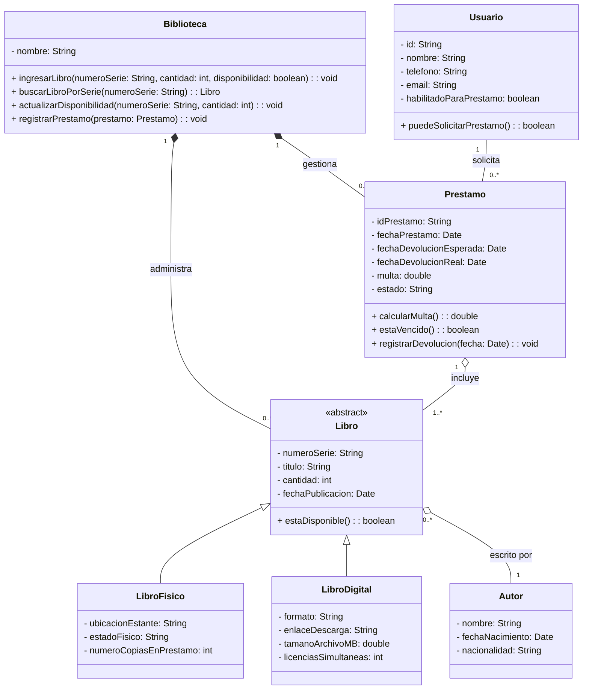

## Presentación de la Actividad

Un diagrama de clases UML es una representación gráfica que permite a los usuarios visualizar la estructura estática de un sistema de software mediante las clases que lo componen, sus atributos, métodos, relaciones entre ellas (asociación, herencia, agregación, composición, etc.). 
Su valor en el diseño de software orientado a objetos es que es una de las herramientas más básicas para la planificación y comunicación; apoya el proceso de desarrollo del diseño antes del código en los equipos de desarrollo de código, el conocimiento del sistema por parte de los miembros del equipo y la documentación técnica del proyecto durante las etapas de desarrollo. En este documento, se nos presenta este tipo de diagrama para representar las principales áreas del dominio (libros, autores, préstamos, etc.) y las relaciones entre ellas, como la autoría de una obra, el préstamo de un ejemplar a un usuario, etc. 
El desarrollo de este modelo se realizó con colaboración (utilizamos la plataforma de diagramación para construir un modelo juntos y visualizarlo PLANT) y un repositorio de GitHub para el control de versiones, la gestión del equipo, la organización de las contribuciones del equipo y la organización del progreso del proyecto.

##  Tabla de contenido

- [Objetivo general](#-objetivo-general)
- [Objetivos específicos](#-objetivos-específicos)
- [Diagrama de clases](#-diagrama-de-clases)
- [Descripción de las clases](#-descripción-de-las-clases-identificadas)
- [Justificación de las relaciones](#-justificación-de-las-relaciones-utilizadas)
- [Cohesión, bajo acoplamiento y SOLID](#-aplicación-de-cohesión-bajo-acoplamiento-y-solid)
- [Archivos del proyecto](#-archivos-del-proyecto)

## Objetivo Principal

Diseñar e implementar un sistema de gestión de bibliotecas que incorpore la teoría de la Programación Orientada a Objetos (abstracción, encapsulamiento, herencia y polimorfismo) y los principios SOLID para crear un modelo de clases robusto, mantenible y escalable. 

## Objetivos Específicos

• Especificar las entidades del dominio (Libro, Autor, Préstamo, Usuario) definiendo sus características y comportamientos clave. 
• Proporcionar jerarquías de clases para la reutilización de código y la extensión de comportamientos. 
• Permitir que las subclases cambien los comportamientos heredados según su naturaleza inherente. 
• Diseñar cada clase para que tenga una única responsabilidad por sí misma. 
• Asegurar que las subclases puedan reemplazar su clase base sin cambiar el comportamiento esperado del sistema. 
• Definir relaciones (asociación, agregación, composición) que estén bien definidas para el nivel de dependencia entre las clases en el sistema.

## Diagrama de clase

